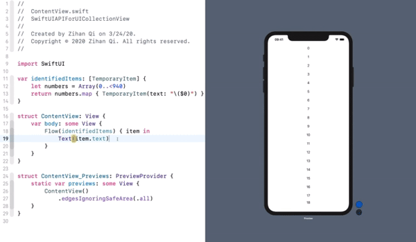

# SwiftUI-CollectionView-API
A custom built SwiftUI API for `UICollectionView`. Significantly simplifies the usage of [UICollectionViewDiffableDataSource](https://developer.apple.com/videos/play/wwdc2019/220/) and [UICollectionViewCompositionalLayout](https://developer.apple.com/videos/play/wwdc2019/215/) with the custom built view modifier that works on any SwiftUI `View`.

